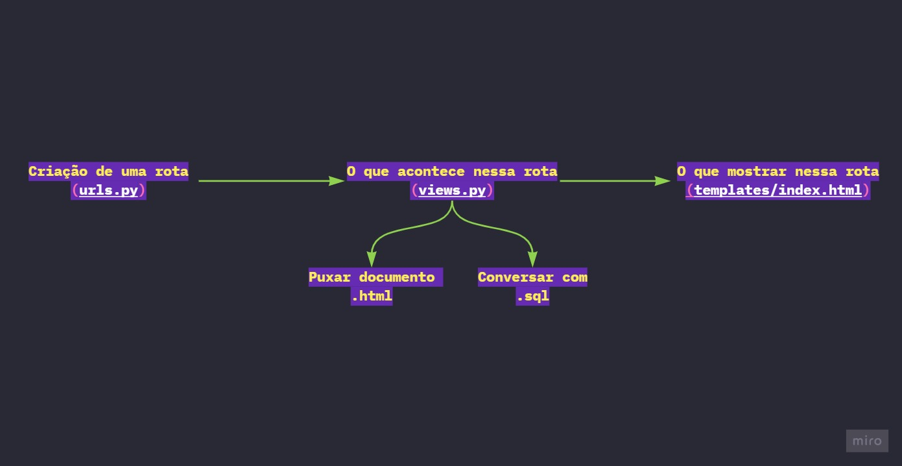

# **Django Study**
Neste repositório estão contidos os meus estudos sobre o framework Django

## 🚀 Projeto
**Criando um projeto django**
```powershell
# powershell

$ django-admin startproject project_name .

# Este comando cria o projeto django. O ponto no fim do comando serve para criar o arquivo "manage.py" no diretório local e não em uma subpasta
```
**Rodando o projeto em um servidor local**
```powershell
# powershell

$ python .\manage.py runserver
# ou
$ python .\manage.py runserver 9000
# 9000 define a porta. se não for especificada a porta, ela será por padrão 8000

# Iniciando Servidor...
```

## 💻 App
**Criando um app**
```powershell
#powershell

$ django-admin startapp app_name

# Criando App...
```
**Agora você deve criar uma url onde você irá colocar conteúdo dentro:**
```python
#python # project/urls.py

from django.contrib import admin
from django.urls import path
from app_home import views

urlpatterns = [
    path('admin/', admin.site.urls),
    path('', views.home, name = 'home')
]

# se você quiser ver essa view em seu projeto, basta rodar o comando:
# $ python .\manage.py runserver 9000
```
**Para visualizar este app, você deve coloca-lo dentro do arquivo views.py:**
```python
#python # app/views.py

from django.shortcuts import render

def home(request):
    # caminho para o html
    # a função render() procura pela pasta "templates" dentro do app
    return render(request, 'users/home.html')
```
**No html que você criar para ser chamado pela view, os botões precisam seguir essa estrutura:**
```html
<form action="" method="post">
    
    <!-- rest of code -->
</form>
```

## Banco de dados
**Diagrama do caminho que a url segue:**


 **para conversar com SQL, vamos trabalhar no arquivo models.py**
```python
# python #app/models.py

from django.db import models

class Users(models.Model):
    id_user = models.AutoField(primary_key=True)
    email = models.TextField(max_length=255)
    password = models.TextField(max_length=255)
```
**Feito isso, devemos criar uma migração que vai trasformar esse código python em SQL**
```powershell
# powershell

$ python .\manage.py makemigrations

#Criando migração...
```
## Banco de dados
**Para aplicar essa migração no arquivo db.sqlite3**
```powershell
# powershell

$ python .\manage.py migrate

# Aplicando migração...
# Feito isso, você pode abrir o arquivo db.sqlite3 e procurar pela tabela app_name_(nome da classe em models)
```
**agora no arquivo views.py, vamos criar a função que puxa a classe que foi criada e também os inputs do formulário html**
```python
# python # views.py

from django.shortcuts import render
from models import User

def home(request):
    return render(request, 'users/home.html')

def users(request):
    new_user = User()
    new_user.email = request.POST.get('email')
    new_user.password = request.POST.get('password')
    new_user.save()
    # exibir usurários cadastrados em uma nova página
    users = {
        'users': User.objects.all()
    }
    return render(request, 'users/users.html', users)
```
**Este código vai fazer um render na página que você especificou. Agora é só criar um HTML para receber ele desta forma:**
```html
<table class="table table-bordered table-stripted">
    <tr>
        <td>id</td>
        <td>email</td>
        <td>password</td>
    </tr>
    
    <tr>
        <td>{{user.id_user}}</td>
        <td>{{user.email}}</td>
        <td>{{user.password}}</td>
    </tr>
    
</table>
```

## 📑 Glossário de comandos
| Command | Description |
| ------- | ----------- |
| `$ django-admin startproject project_name .` | Cria um projeto Django|
| `$ django-admin startapp app_name`           | Cria um App Django|
| `$ python .\manage.py runserver`             | Inicia o app num servidor local|
| `$ python .\manage.py makemigrations`        | Inicia o app num servidor local|
| `$ python .\manage.py migrate`               | faz a migração no banco de dados|